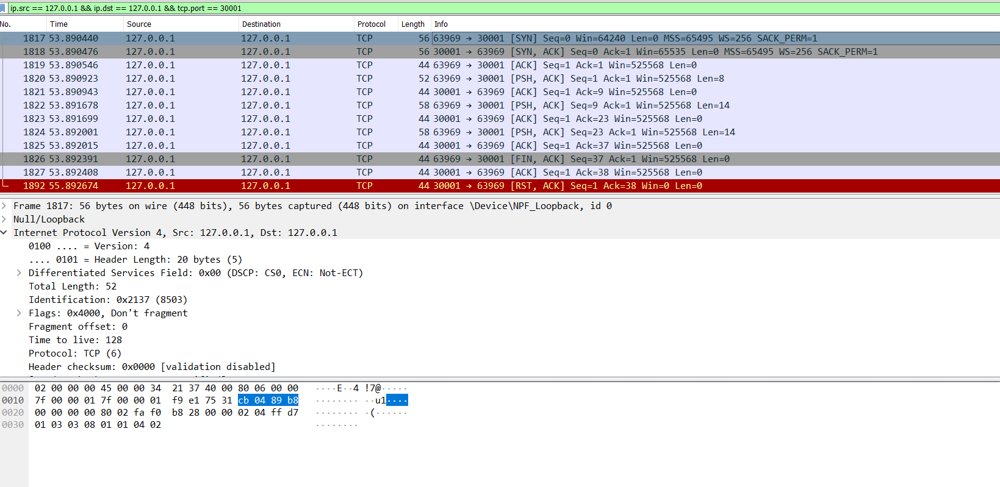
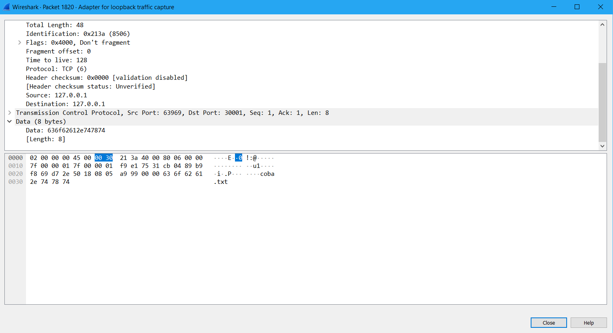
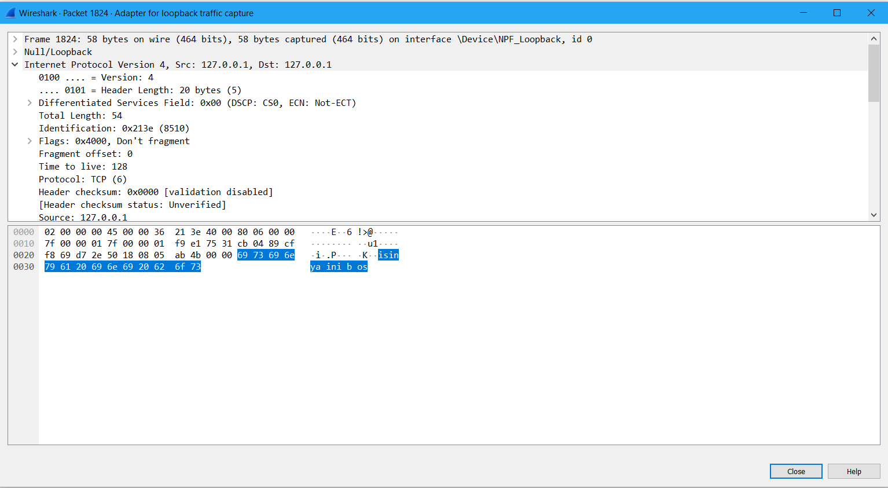
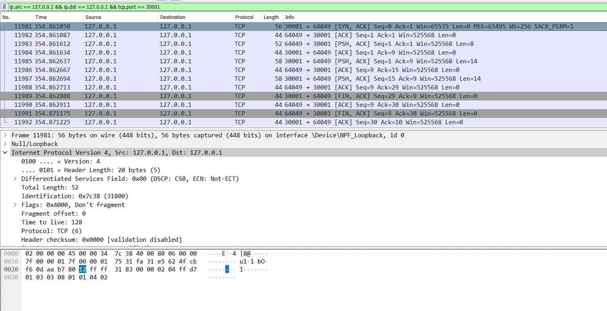
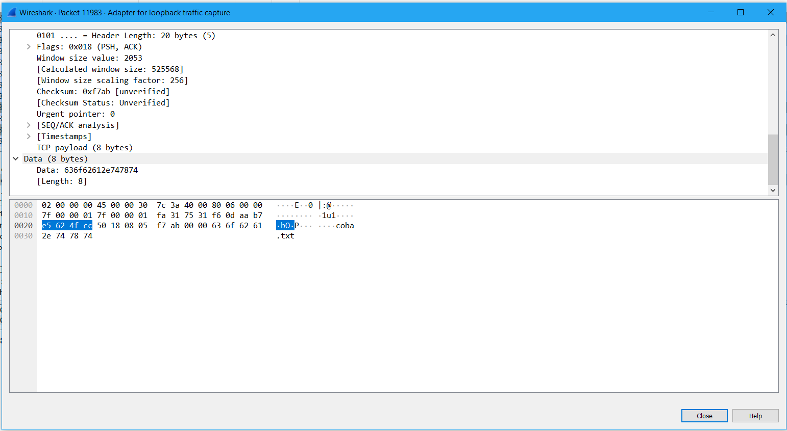
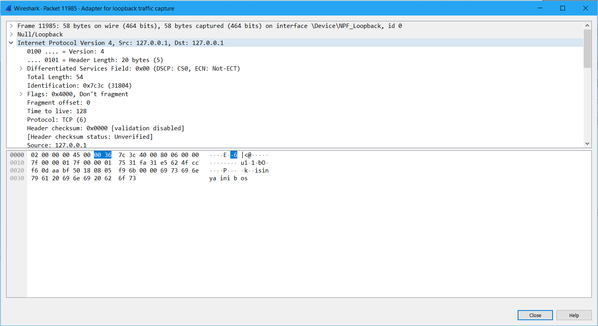
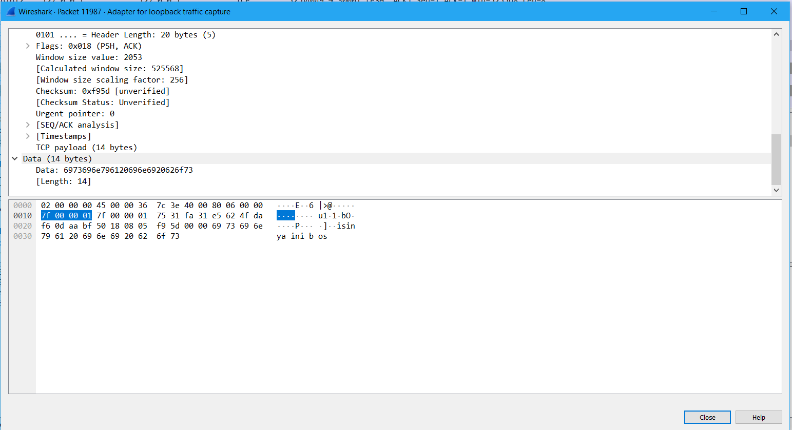

Penjelasan

tugas 1a
dapat dilihat list paket saat pengiriman file tugas 1a, terdapat paket yang mengirim nama file dan isi file oleh client, lalu diterima oleh server.

1. List paket

2. File yang dikirim

3. Isi file

4. Isi yang diterima

tugas 1b
dapat dilihat list paket, client merequest suatu file, lalu server mencari file tersebut dan mengirimkan isinya. 

1. List paket

2. File yang direquest client

3. File yang dikirim

4. File yang diterima

