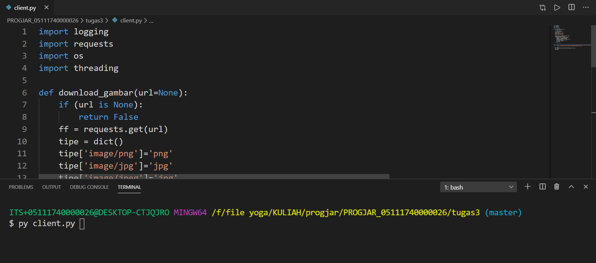
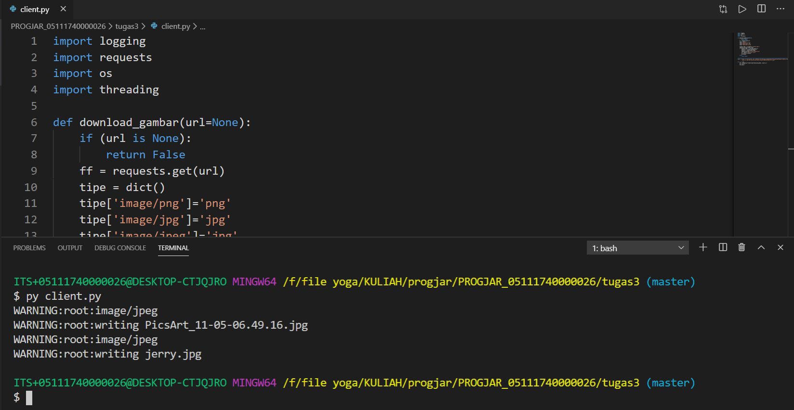

<h2>Melakukan download gambar dengan multithreading</h2>

Program akan melakukan download dengan menggunakan multi threading. Disini saya menggunakan 2 thread, dimana thread akan bekerja secara synchronus (menunggu thread sebelumnya selesai, lalu lanjut ke thread selanjutnya).

1. Menjalankan client.py

2. Jalannya client.py pada terminal

3. Gambar yang diunduh (2 gambar)

