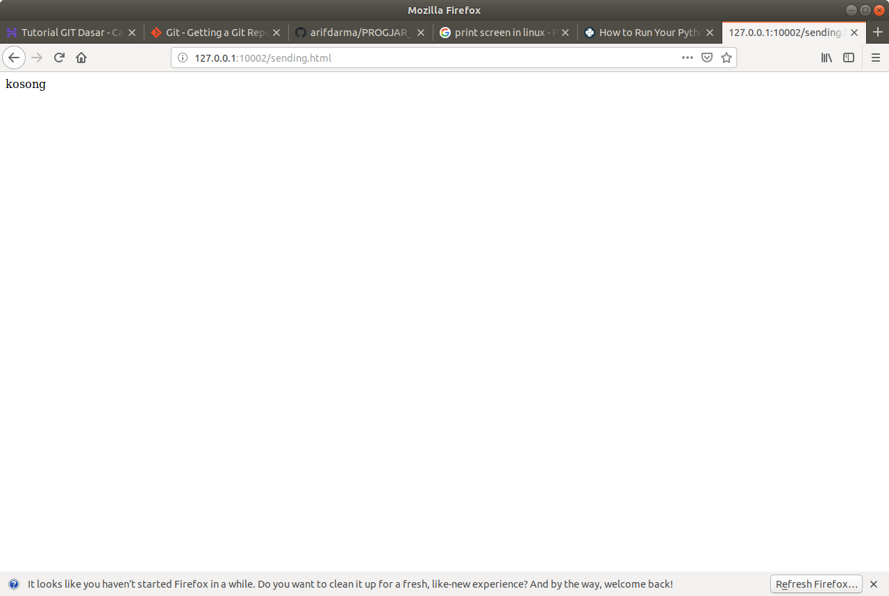
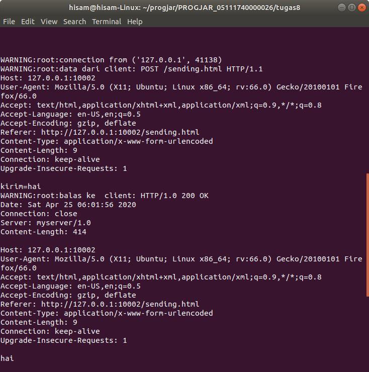

# Tugas 8
* Mencoba menjalankan server_thread_http.py dengan port 10002 dari folder progjar5:

* Dapat dilihat, bahwa hasil outputnya adalah kosong, tidak sesuai dengan inputan awal

* Lalu, mengubah http.py agar dapat mengeluarkan output berupa header serta kata yang diinput. Berikut hasil output perubahannya:

* Sekarang output yang dikeluarkan adalah header dari requestnya ditambah kata inputan awal tadi

* Terima kasih
